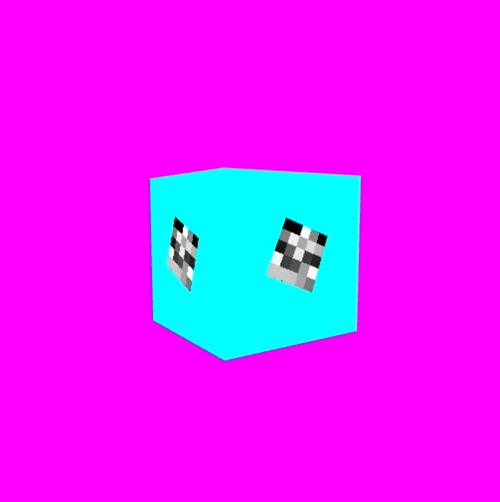

# p5Fbo



p5Fbo is an extension to p5 that allows you to use framebuffer objects. Framebuffers allow us to do our rendering into a webGL texture instead of directly to the screen in a canvas.

This project is very much a work in progress.

## Why not just use createGraphics()

The `createGraphics()` function is great, but it has some limitations. Every time you call createGraphics, p5 creates an entirely new canvas object, containing a new webGL context. Browsers limit the number of webGL contexts that you can have on a single page. If you try and create too many, the browser will remove the oldest ones. It likely varies by browser, but in my recent testing I hit the limit around 14.

Framebuffers allow us to get around this limitation. Now we can have as many offscreen buffers as we like, without the overhead of creating a new webGL context for each one.

Framebuffers are potentially faster as well. I haven't done any bench marking yet, but I have a hunch that using frame buffers will be much more performant than using `createGraphics();`.

## Installation

Just add the p5.js library, as well as the p5Fbo.js library somewher in your html file.

```html
<head>
  <title>p5Fbo example</title>
  <script language="javascript" type="text/javascript" src="../p5.js"></script>
  <script language="javascript" type="text/javascript" src="../p5Fbo.js"></script>
  <script language="javascript" type="text/javascript" src="sketch.js"></script>
</head>
```

## Usage

The best way to get started is probably to duplicate the example in this repo. 

To use p5Fbo, just instantiate a new p5Fbo object in your setup function.

```javascript
let fbo;
let shader;
void setup(){
  const canvas = createCanvas(500, 500, WEBGL);
  fbo = new p5Fbo({renderer: canvas, width: 500, height: 500});

  // Lets load a shader as well. 
  shader = createShader(vertSrc, fragSrc)
}
```

To do some drawing into the fbo you first need to call fbo.begin(). When you're done drawing, just call fbo.end(). If you've ever used fbo's in openFrameworks, this will be very familiar.

```javascript
void draw(){
  // activate our fbo
  fbo.begin();

  // Call clear at the beginning of each frame
  fbo.clear();

  // Do our drawing
  background(0, 255, 0);
  push();
    rotateX(frameCount * 0.01);
    fill(255, 0, 0);
    box(100);
  pop();

  // We're done drawing into the fbo so call .end()
  fbo.end();

  // Now we need to draw the fbo to the screen. 
  // One limitation of the library at the moment, is that you can only draw fbo textures to the screen using a shader

  shader(myShader);
  // Send the fbo texture to the shader. We do this with .getTexture()
  myShader.setUniform('tex0', fbo.getTexture());
  rect(-width/2, -height/2, width, height);
}
```

## Api

### Constructor

``` javascript
const fbo = new p5Fbo({renderer, width, height, interpolationMode, wrapMode});
```

### Constructor settings

- renderer: The p5 renderer.
  - For the base canvas, this will be what is returned from createCanvas. `const canvas = createGraphics(100, 100, WEBGL)`
  - For p5.Graphics objects, this will be the `._renderer` property returned from createGraphics.
    - `const graphics = createGraphics(100, 100, WEBGL);`
    - `const renderer = graphics._renderer;`
- width: The width of the fbo render texture
- height: the height of the fbo render texture
- interpolationMode: (optional) either LINEAR or NEAREST. defaults to LINEAR
- wrapMode: (optional) either CLAMP, REPEAT, or MIRROR. defaults to CLAMP

### `p5Fbo.begin()`

Tells p5 to start rendering into the framebuffer. Call this before you before you want to use the fbo.

### `p5Fbo.end()`

Tells p5 to stop rendering into the framebuffer. It's very important to remember to call this function, otherwise p5 will keep rendering into the framebuffer, and you'll get weird results on screen.

### `p5fbo.getTexture()`

returns the p5.Texture that the framebuffer is rendering into.

### `p5Fbo.copyTo(dstFbo)`

Copies contents of one fbo to another.
Example: `fboA.copyTo(fboB);`.

## Limitations

1. Many changes that enable p5Fbo to work properly were only added recently, and aren't included in any p5 releases yet. You will need to use the custom built p5.js or p5.min.js libraries in this repo, or build p5 yourself from source.

2. The rendering format is set to RGBA Unsigned Byte. It should be possible to do float textures, but I haven't looked into it yet.

3. I haven't tested if this works with custom cameras yet. 

## Todo list

- [ ] Check that custom cameras work
- [ ] Float textures (partially implemented, but depends on some changes to p5)

## Credits

I learned a lot about framebuffers from [Gregg Tavares WebGL fundamentals series](https://webglfundamentals.org/webgl/lessons/webgl-render-to-texture.html). It's worth checking out if you'd like to learn more.
